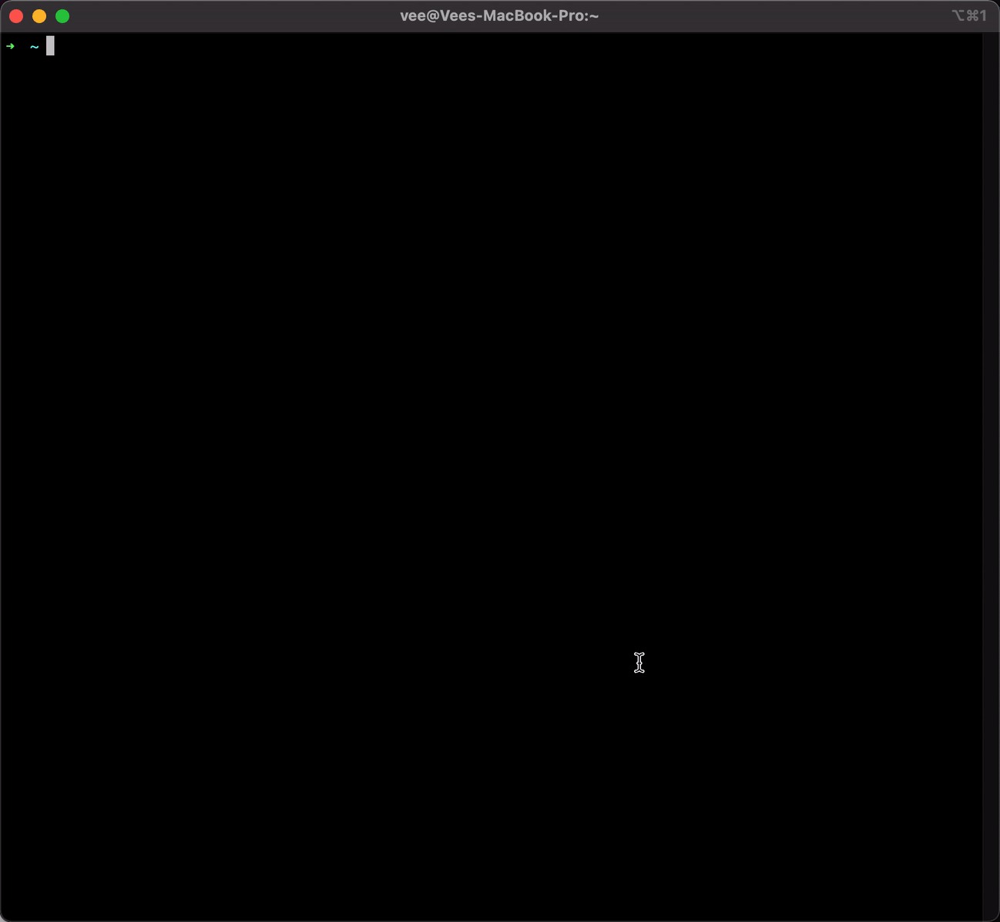
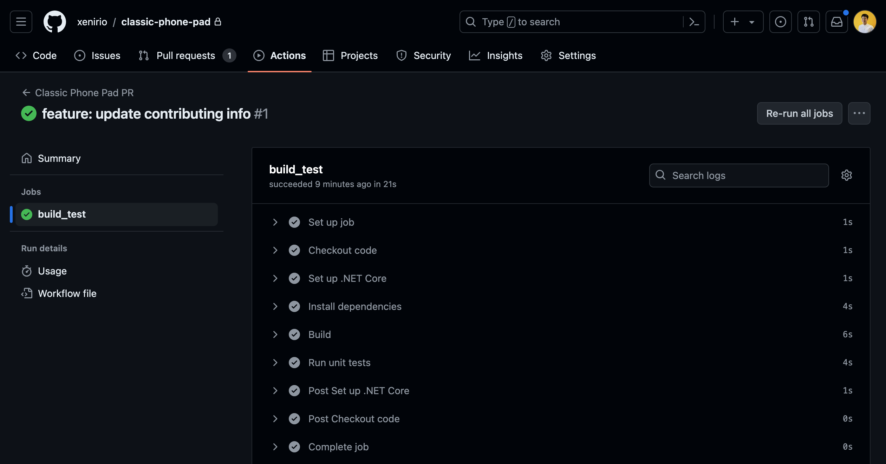

# Classic Phone Pad

This is a simple project that simulates a classic phone pad. It was built using C# with Console Application.

## Prerequisites

- .NET Core 8.0 or higher installed on your machine. You can download it [here](https://dotnet.microsoft.com/download).

- Visual Studio Code or Visual Studio 2022 installed on your machine. You can download Visual Studio Code [here](https://code.visualstudio.com/download) and Visual Studio 2022 [here](https://visualstudio.microsoft.com/).

## How to run

1. Clone this repository to your machine.
2. Open terminal or command prompt and navigate to the project folder.
3. Restore the project dependencies:

    ```bash
    dotnet restore
    ```
4. Build the project:

    ```bash
    dotnet build
    ```
5. Run the project:

    ```bash
    dotnet run
    ```



## Contributing

1. Fork this repository.

2. Create a new branch with your feature or fix:

    ```bash
    git checkout -b feat/my-feature
    ```

3. Commit your changes:

    ```bash
    git commit -m 'feat: My new feature'
    ```

4. Push your branch:

    ```bash
    git push origin feat/my-feature
    ```

5. Create a pull request.

6. Make sure your PR can pass the CI/CD pipeline.

   

7. After your PR is approved and merged, don't forget to delete your branch.
