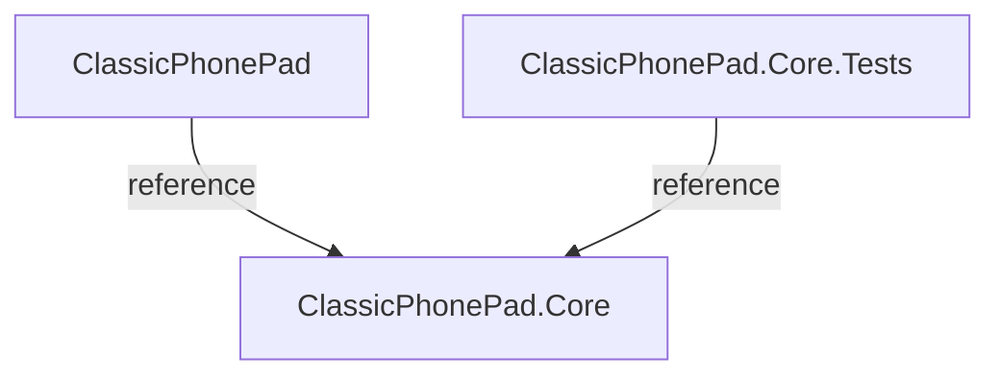

# Classic Phone Pad

This is a simple project that simulates a classic phone pad with the numbers from 0 to 9 and the letters that are associated with each number, backspace key, and a send button.
Each button is numbered, and pressing a button repeatedly cycles through the letters assigned to it, allowing each button to represent multiple letters.

You can input sequences of numbers with the operators `*` and `#` and the program will output the corresponding letters.

## Prerequisites

- .NET Core 8.0 or higher installed on your machine.  
  Download .NET Core 8.0 from [https://dotnet.microsoft.com/download](https://dotnet.microsoft.com/download).

- Visual Studio Code or Visual Studio 2022 installed on your machine.  
  Download Visual Studio Code from [https://code.visualstudio.com/download](https://code.visualstudio.com/download)  
  Download Visual Studio 2022 from [https://visualstudio.microsoft.com](https://visualstudio.microsoft.com).

## Project Structure

- ### ClassicPhonePad
  A console application that uses the core library to simulate the classic phone pad.

- ### ClassicPhonePad.Core 
  A class library that contains the classes and interfaces that define the core logic of the application.

- ### ClassicPhonePad.Core.Tests
  A class library that contains the unit tests for the core library.



## How to run

1. Clone this repository to your machine.
2. Open terminal or command prompt and navigate to the project folder.
3. Restore the project dependencies:

    ```bash
    dotnet restore
    ```
4. Build the project:

    ```bash
    dotnet build
    ```
5. Run the project:

    ```bash
    dotnet run
    ```


## Contributing

1. Fork this repository.

2. Create a new branch with your feature or fix:

    ```bash
    git checkout -b feat/my-feature
    ```

3. Commit your changes:

    ```bash
    git commit -m 'feat: My new feature'
    ```

4. Push your branch:

    ```bash
    git push origin feat/my-feature
    ```

5. Create a pull request.

6. Make sure your PR can pass the CI/CD pipeline.

   

7. After your PR is approved and merged, don't forget to delete your branch.
